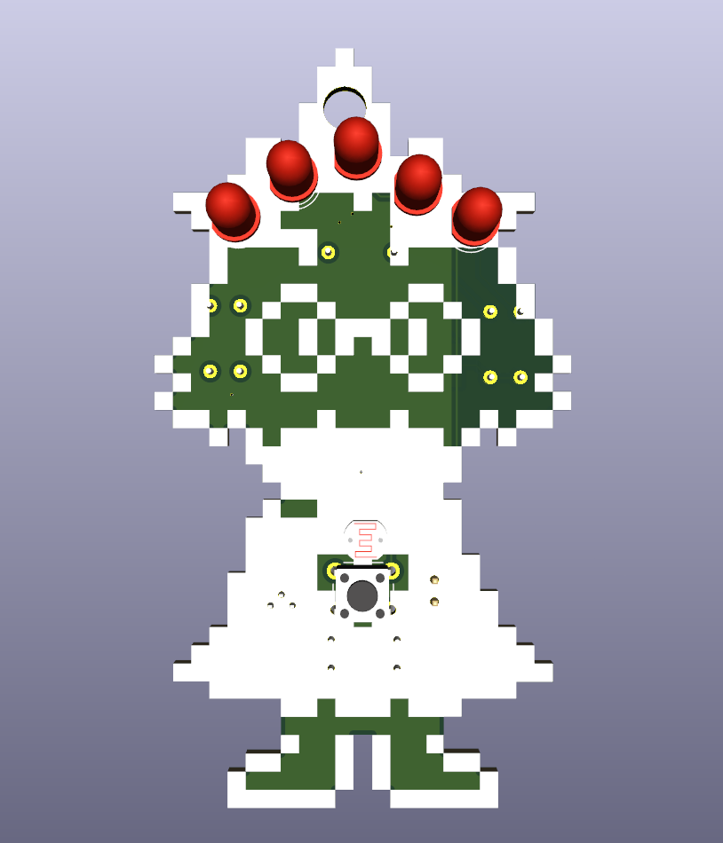
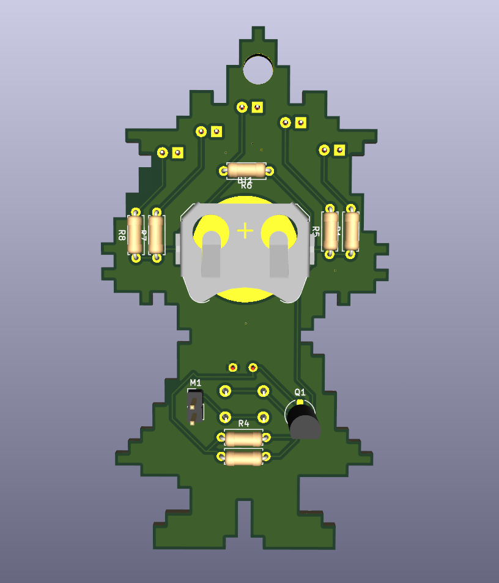
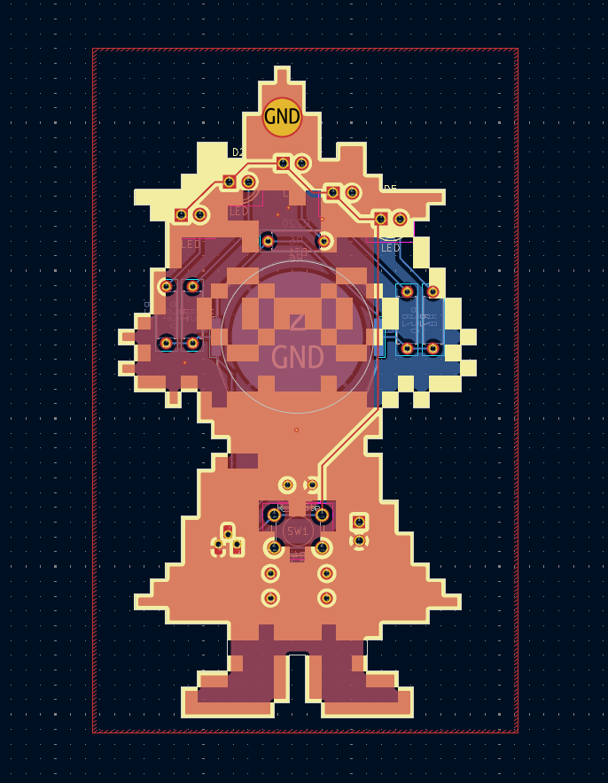
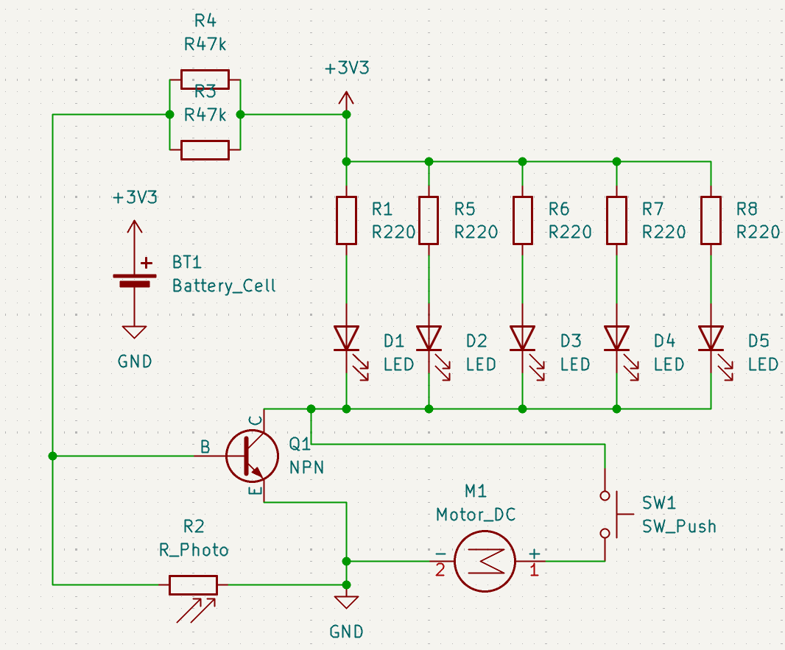

# glowsei

Ralsei-shaped PCB with LEDs that turn on automatically in the dark, and a button to override and turn on all LEDs, and a mini motor disc as well.

## Bill Of Materials (BOM)

| Component                | Quantity |
| ------------------------ | -------- |
| 5mm LEDs                 | 5        |
| Photoresistor (GL5528)   | 1        |
| 220Ω Resistors           | 5        |
| 47kΩ Resistors           | 2        |
| NPN Transistor (2N3904)  | 1        |
| Mini Motor Disc/DC Motor | 1        |
| Push Button (6mm THT)    | 1        |
| CR2032 Battery Cell      | 1        |

## Images

| Image | Description |
| ----- | ----------- |
|  | Front 3D View |
|  | Back 3D View |
|  | PCB |
|  | Schematic |

---
Made for <https://solder.hackclub.com/>

`U08R49H9VRV` on slack
